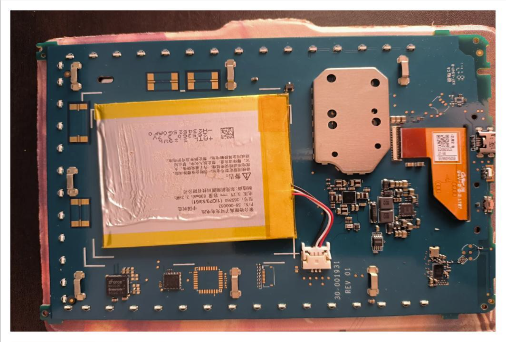
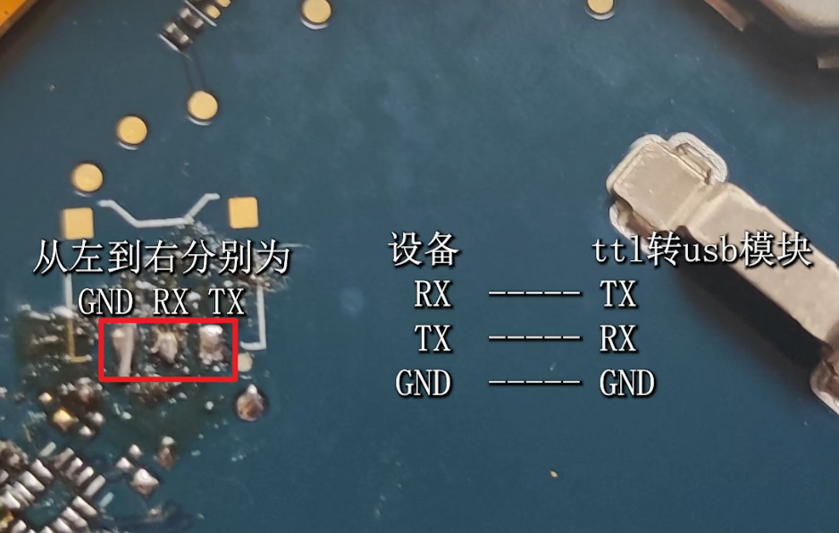
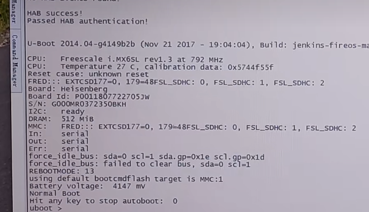

# KindleX 咪咕 折腾笔记

## 引言

机子太古老了，以前折腾过就放着吃灰了，突然想起，便拿出来看看，发现以前的教程也没有了，也忘记一部分操作，遂记录一下。~~其实折腾后也没什么区别。~~

注：此教程仅开启ADB与安装第三方应用。文档文件存放于https://github.com/Angels-Ray/Kindle_X_Migu

## 设备

- Kindle 8 系列下的 Kindle 咪咕，型号 `SY69JL`。
- CPU: `iMX6`
- 系统: Android 4.4 (或许)
- 存在 Bootloader 锁与 uboot
- 存在 串行接口，波特率 `115200`

分析：设备是Android，与传统的Kindle的Linux系统不太一样，略显奇特。默认是不开启ADB的，同时也开启了Selinux的严格模式。Uboot是有启动校验的，不能刷写其他uboot。也存在Booloader锁，记得 @Ygjsz 说过，似乎修改某个启动判断是可以绕过启动校验，刷写其他系统（此教程无刷第三方系统）。

## 折腾记录

### 引出串口

先把外壳拆掉，拆开外壳后，(正面)有一个黑色遮光罩用黑胶与屏幕粘连(与触控相关)，注意遮光罩有两个角有凸起，防止弄断。

背面有串行接口，需要引出





### 设置Uboot环境变量

使用TTL转usb工具连上电脑，重启设备，按任意键打断启动系统，进入uboot



查看原版的uboot环境变量

```bash
uboot > printenv
baudrate=115200
boot_fdt=no
bootcmd=mmc dev ${mmcdev};if mmc rescan; then run testboot; fi; 
bootdelay=1
fastboot_dev=mmc1
fdt_high=0xffffffff
initrd_high=0xffffffff
loadaddr=0x80800000
mmcautodetect=yes
mmcdev=1
mmcroot=/dev/mmcblk0p1 rootwait rw
setmmcdev=mmc dev 1 0; 
splashpos=m,m
testboot=echo BOOTing from mmc ...; booti mmc1
```

设置启动参数(`bootargs`)，如果需要刷 @Ygjsz 的系统就需要把`bootargs`清空

```bash
setenv bootargs 'console=ttymxc0,115200 init=/init androidboot.console=ttymxc0 consoleblank=0 androidboot.hardware=freescale androidboot.selinux=permissive uart_at_4M androidboot.serialno=G000MR03752405NF androidboot.unlocked_kernel=false androidboot.prod=1'
```

设置启动命令(`bootcmd`)

```bash
setenv bootcmd 'mmc dev ${mmcdev};if mmc rescan; then fuse override 4 6 0x00000020; run testboot; fi;'
```

保存环境变量后重启到系统

```bash
saveenv
fuse override 4 6 0x00000020
reset
```

详细日志：

```bash
uboot > setenv bootcmd 'mmc dev ${mmcdev};if mmc rescan; then fuse override 4 6 0x00000020; run testboot; fi;'
uboot > setenv bootcmd 'mmc dev ${mmcdev};if mmc rescan; then fuse override 4 6 0x00000020; run testboot; fi;'
uboot > saveenv
Saving Environment to MMC...
Writing to MMC(1)... done
uboot > printenv
baudrate=115200
boot_fdt=no
bootargs=console=ttymxc0,115200 init=/init androidboot.console=ttymxc0 consoleblank=0 androidboot.hardware=freescale androidboot.selinux=permissive uart_at_4M androidboot.serialno=G000MR03752405NF androidboot.unlocked_kernel=false androidboot.prod=1
bootcmd=mmc dev ${mmcdev};if mmc rescan; then fuse override 4 6 0x00000020; run testboot; fi;
bootdelay=1
fastboot_dev=mmc1
fdt_high=0xffffffff
initrd_high=0xffffffff
loadaddr=0x80800000
mmcautodetect=yes
mmcdev=1
mmcroot=/dev/mmcblk0p1 rootwait rw
setmmcdev=mmc dev 1 0; 
splashpos=m,m
testboot=echo BOOTing from mmc ...; booti mmc1

Environment size: 643/8188 bytes
uboot > fuse override 4 6 0x00000020
Overriding bank 4 word 0x00000006 with 0x00000020...
uboot > reset

```

### 开启ADB

进入系统后，开启工程模式即打开usb调试

```bash
touch /data/system/FACTORYMODE
reboot
```

### 安装第三方应用

悬浮窗 `easytouch.apk`

启动器 `eink_2icon.apk`

启动悬浮窗 `adb shell am start -n com.shere.easytouch/com.shere.easytouch.ui350.MainSplashActivity`

隐藏状态栏 `adb shell settings put global policy_control immersive.navigation=*`

其他ADB命令

```bash
adb shell pm list packages
停用：adb shell pm disable-user 包名
启用：adb shell pm enable 包名
卸载：adb shell pm uninstall --user 0 包名
```

### SSH

adb没有root权限，但是可以安装dropbear以远程ssh，那么就有了root权限，无密码

```bash
adb push ssh /sdcard/ssh/
```

```bash
mount -o remount,rw /system

cp /sdcard/ssh/dropbear /system/xbin/dropbear
cp /sdcard/ssh/dropbearkey /system/xbin/dropbearkey
cp /sdcard/ssh/scp /system/xbin/scp
cp /sdcard/ssh/ssh /system/xbin/ssh

chmod 755 /system/xbin/dropbear
chmod 755 /system/xbin/dropbearkey
chmod 755 /system/xbin/scp
chmod 755 /system/xbin/ssh

mkdir -p /data/dropbear/.ssh 
chmod 644 /data/dropbear
chmod 644 /data/dropbear/.ssh
#生成密钥
dropbearkey -t rsa -f /data/dropbear/dropbear_rsa_host_key
#生成密钥
dropbearkey -t dss -f /data/dropbear/dropbear_dss_host_key
#建立用的环境变量
echo >> /data/dropbear/.profile  "PATH=/sbin:/vendor/bin:/system/sbin:/system/bin:/system/xbin"
#建立用的环境变量
echo >>/data/dropbear/.profile "export PATH" 
#做目录快捷方式
ln -s /data/dropbear /etc/dropbear

dropbear -V

# 公钥
# cp /sdcard/ssh/keys/authorized_keys /data/dropbear/.ssh/authorized_keys
# chmod 600 /data/dropbear/.ssh/authorized_keys

cp /system/bin/set_time.sh /system/bin/set_time.sh.bak 
vi /system/bin/set_time.sh
# 添加： /system/xbin/dropbear -v

mount -o remount,ro /system
```

## 恢复

### SSH

```bash
mount -o remount,rw /system
rm -rf /system/xbin/dropbear
rm -rf /system/xbin/dropbearkey
rm -rf /system/xbin/scp
rm -rf /system/xbin/ssh
rm -rf /data/dropbear
rm -rf /etc/dropbear
cp /system/bin/set_time.sh.bak /system/bin/set_time.sh
mount -o remount,ro /system
```

### Uboot

```bash
setenv bootargs
setenv bootcmd 'mmc dev ${mmcdev};if mmc rescan; then run testboot; fi; '
saveenv
reset
```